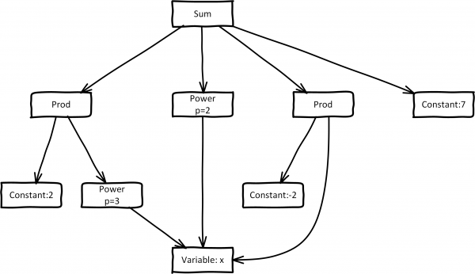
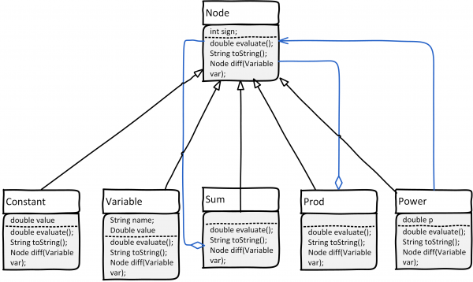

# Wyrażenia matematyczne

Podczas laboratorium zaimplementujemy kilka klas pozwalających na reprezentację prostych wyrażeń matematycznych (funkcji jednej lub kilku zmiennych) jako grafów. Podobna reprezentacja jest rdzeniem funkcji oferowanych na przykład przez [https://live.sympy.org/](https://live.sympy.org/) lub [https://www.derivative-calculator.net/](https://www.derivative-calculator.net/). Nie będziemy jednak "parsowali" wyrażeń, czyli budowali grafowej reprezentacji na podstawie specyfikacji tekstowej. Zamiast tego, wyrażenia będą budowane za pomocą odpowiednio skonstruowanego kodu.

Założona funkcjonalność:

- budowa wyrażeń
- obliczanie wartości wyrażeń/funkcji dla różnych wartości zmiennych
- wydruk wyrażeń
- symboliczne obliczanie pochodnych (opcjonalnie)

## Jakie klasy będą potrzebne

Przeanalizujmy wyrażenie 2x<sup>3</sup> + x<sup>2</sup> - 2x + 7

Jego elementami są:

- stałe (np. 2 i 7)
- zmienne (x)
- funkcja potęgowa (x<sup>3</sup>, x<sup>2</sup>) - `Power(arg, p)`
- operacja mnożenia - `Prod(args...)`
- operacja dodawania - `Sum(args...)`

Wyrażenie 2x<sup>3</sup> + x<sup>2</sup> - 2x + 7 może być zapisane jako `Sum(Prod(2, Power(x, 3)), Power(x, 2), Prod(-2, x), 7)`. Zakładając, że każdy z tych elementów będzie obiektem, otrzymamy reprezentację w postaci acyklicznego grafu, jak na poniższym rysunku. Węzłami grafu są stałe, zmienne, operacje i funkcje, natomiast krawędzie odpowiadają argumentom poszczególnych operacji.

W zasadzie jest to drzewo, którego liśćmi są zmienne i stałe. Ponieważ zmienne mogą powtarzać się, liście będące zmiennymi zostały złączone



Zaimplementujemy więc klasy, jak na poniższym diagramie i dodamy wspólnego przodka, abstrakcyjną klasę `Node`. Niebieskie linie to asocjacje/agregacje łączące węzły nadrzędne (opreacje, funkcje) i ich argumenty.

- Argumentem `Power` jest jakieś wyrażenie, czyli `Node`.
- `Sum` może mieć więcej argumentów, stąd agregacja elementów `Node`
- `Prod` (*product*) to iloczyn większej liczby czynników `Node`



## Implementujemy klasy

### Node

```java
abstract public class Node {
    int sign = 1;

    Node minus() {
        sign = -1;
        return this;
    }

    Node plus() {
        sign = 1;
        return this;
    }

    int getSign() {
        return sign;
    }

    /**
     * Oblicza wartość wyrażenia dla danych wartości zmiennych
     * występujących w wyrażeniu
     */
    abstract double evaluate();

    /**
     * zwraca tekstową reprezentację wyrażenia
     */
    public String toString() {
        return "";
    }

    /**
     * Zwraca liczbę argumentów węzła
     */
    int getArgumentsCount() {
        return 0;
    }
}
```

W klasie `Node` wprowadzono atrybut `sign` znak, dziedziczony przez klasy potomne. Potraktujmy to następująco. Załóżmy, że reprezentacją tekstową węzła jest `abcd`

jeśli `sign < 0` reprezentacją tekstową będzie `-(abcd)` [w nawiasach]
jeśli `sign >= 0` będzie to po prostu `abcd` [bez nawiasów]

### Constant

```java
public class Constant extends Node {
    double value;
    Constant(double value) {
        this.sign = value < 0 ? -1 : 1;
        this.value = value < 0 ? -value : value;
    }

    @Override
    double evaluate() {
        return sign * value;
    }

    @Override
    public String toString() {
        String sgn = sign < 0 ? "-" : "";
        // return sgn + Double.toString(value);
        DecimalFormat format = new DecimalFormat("0.#####", new DecimalFormatSymbols(Locale.US));
        return sgn + format.format(value);
    }
}
```

Stosując `DecimalFormat` pozbędziemy się niepotrzebnych zer na końcu wartości `double`.

### Variable

Klasa `Variable` reprezentuje zmienną, która może być użyta w wyrażeniach.

```java
public class Variable extends Node {
    String name;
    Double value;

    Variable(String name) {
        this.name = name;
    }

    void setValue(double d) {
        value = d;
    }

    @Override
    double evaluate() {
        return sign * value;
    }

    @Override
    public String toString() {
        String sgn = sign < 0 ? "-" : "";
        return sgn + name;
    }
}
```

### Power

`Power` jest jedyną zaimplementowaną funkcją. Zauważmy, że  
`Power(x,−1)` = 1/x. Argumentem `Power` nie musi być pojedyncza zmienna. Może to być np.:` Power(Sum(x, 2), -2)`, czyli  
1/(x + 2)<sup>2</sup>

W kodzie pokazano przykładową implementację `toString()` z próbą wstawienia nawiasów w takich przypadkach, jak −(−x<sup>5</sup>) lub (x + 1)<sup>2</sup>

```java
public class Power extends Node {
    double p;
    Node arg;

    Power(Node n, double p) {
        arg = n;
        this.p = p;
    }

    @Override
    double evaluate() {
        double argVal = arg.evaluate();
        return Math.pow(argVal, p);
    }

    int getArgumentsCount() {
        return 1;
    }

    @Override
    public String toString() {
        StringBuilder b = new StringBuilder();
        
        if (sign < 0) {
            b.append("-");
        }

        int argSign = arg.getSign();
        int cnt = arg.getArgumentsCount();
        boolean useBracket = false;
        
        if (argSign < 0 || cnt > 1) {
            useBracket = true;
        }
        
        String argString = arg.toString();
        
        if (useBracket) {
            b.append("(");
        }
        
        b.append(argString);
        
        if (useBracket) {
            b.append(")");
        }
        
        b.append("^");
        b.append(p);
        return b.toString();
    }
}
```

### Sum

Klasa `Sum` jest wyrażeniem reprezentującą sumę argumentów. Zawiera listę węzłów `List<Node> args = new ArrayList<>();`

Teoretycznie, lista argumentów może liczyć 0, 1, 2, ... elementów. Metoda `add()` dodaje składniki do listy

```java
public class Sum extends Node {
    List<Node> args = new ArrayList<>();

    Sum() {}

    Sum(Node n1, Node n2) {
        args.add(n1);
        args.add(n2);
    }

    Sum add(Node n) {
        args.add(n);
        return this;
    }

    Sum add(double c) {
        args.add(new Constant(c));
        return this;
    }

    Sum add(double c, Node n) {
        Node mul = new Prod(c, n);
        args.add(mul);
        return this;
    }

    @Override
    double evaluate() {
        double result = 0;
        // oblicz sumę wartości zwróconych przez wywołanie evaluate składników sumy
        return sign * result;
    }

    int getArgumentsCount() {return args.size();}

    public String toString() {
        StringBuilder b =  new StringBuilder();

        if (sign < 0) {
            b.append("-(");
        }

        // zaimplementuj

        if (sign < 0) {
            b.append(")");
        }
        return b.toString();
    }
}
```

### Prod

`Prod` to iloczyn (ang. *product*). Reprezentuje wyrażenie będące iloczynem czynników. Metoda `mul()` dodaje czynnik do listy.

```java
public class Prod extends Node {
    List<Node> args = new ArrayList<>();

    Prod() {}

    Prod(Node n1) {
        args.add(n1);
    }

    Prod(double c) {
        //wywołaj konstruktor jednoargumentowy przekazując new Constant(c)
    }

    Prod(Node n1, Node n2) {
        args.add(n1);
        args.add(n2);
    }

    Prod(double c, Node n) {
        // wywołaj konstruktor dwuargumentowy
    }

    Prod mul(Node n) {
        args.add(n);
        return this;
    }

    Prod mul(double c) {...}

    @Override
    double evaluate() {
        double result =1;
        // oblicz iloczyn czynników wołąjąc ich metodę evaluate
        return sign * result;
    }

    int getArgumentsCount() {
        return args.size();
    }

    public String toString() {
        StringBuilder b =  new StringBuilder();
        
        if (sign < 0) {
            b.append("-");
        }
        
        // zaimplementuj
        return b.toString();
    }
}
```

## Testujemy implementację

### Test 1

```java
static void buildAndPrint() {
    Variable x = new Variable("x");
    Node exp = new Sum()
            .add(2.1, new Power(x, 3))
            .add(new Power(x, 2))
            .add(-2, x)
            .add(7);
    System.out.println(exp.toString());
}
```

Oczekiwany wynik: `2.1*x^3 + x^2 + (-2)*x + 7`

### Test 2

```java
static void buildAndEvaluate() {
    Variable x = new Variable("x");
    Node exp = new Sum()
            .add(new Power(x, 3))
            .add(-2,new Power(x, 2))
            .add(-1, x)
            .add(2);
    for (double v = -5; v < 5; v += 0.1) {
        x.setValue(v);
        System.out.printf(Locale.US, "f(%f)=%f\n", v, exp.evaluate());
    }
}
```

Sprawdź, jakie są pierwiastki?

### Test 3

```java
static void defineCircle() {
    Variable x = new Variable("x");
    Variable y = new Variable("y");
    Node circle = new Sum()
            .add(new Power(x, 2))
            .add(new Power(y, 2))
            .add(8, x)
            .add(4, y)
            .add(16);
    System.out.println(circle.toString());

    double xv = 100 * (Math.random() - .5);
    double yv = 100 * (Math.random() - .5);
    x.setValue(xv);
    y.setValue(yv);
    double fv = circle.evaluate();
    System.out.print(String.format("Punkt (%f,%f) leży %s koła %s", xv, yv, (fv < 0 ? "wewnątrz" : "na zewnątrz"), circle.toString()));
}
```

Znajdź i wypisz 100 punktów leżących wewnątrz okręgu... Oczywiście napisz kod, który je znajduje :wink:

## Symboliczne obliczanie pochodnych

**Zadanie do realizacji w domu.**

Pochodna wyrażenia jest również wyrażeniem... Dodajmy metodę `diff()` w klasie `Node`

```java
abstract Node diff(Variable var);
```

Dodajmy jeszcze metodę

```java
abstract boolean isZero();
```

która będzie służyła do optymalizacji wywołań (pomijamy wyrażenia o wartości 0).

## Pochodne

### Constant

Zawsze pochodną stałej jest zero.

```java
@Override
Node diff(Variable var) {
    return new Constant(0);
}
```

### Variable

Pochodna d/dx (x) = 1, natomiast d/dx (y) = 0

```java
Node diff(Variable var) {
    if (var.name.equals(name)) {
        return new Constant(sign);
    } else {
        return new Constant(0);
    }
}
```

### Power

Z definicji d/dx (x<sup>n</sup>) = nx<sup>n-1</sup>, ale tak naprawdę powinniśmy potraktować to jako złożenie funkcji `Power(arg(x), p)`, stąd
d/dx (arg(x)<sup>n</sup>) = n * arg(x)<sup>n-1</sup> * d/dx (arg(x))

```java
Node diff(Variable var) {
    Prod r =  new Prod(sign*p,new Power(arg,p-1));
    r.mul(arg.diff(var));
    return r;
}
```

### Sum

Pochodna sumy jest sumą pochodnych. Najprostsza implementacja jest podana poniżej.

```java
Node diffVanilla(Variable var) {
    Sum r = new Sum();
    for(Node n:args) {
        r.add(n.diff(var));
    }
    return r;
}
```

Niestety, dużo pochodnych składowych będzie zerowych. Stąd propozycja usprawnienia przez sprawdzenie przed dodaniem, czy wyrażenie nie jest zerem.

### Prod

Ogólny algorytm iloczynu jest podany np. tu [https://en.wikipedia.org/wiki/Product_rule](https://en.wikipedia.org/wiki/Product_rule). Zauważmy, że stosuje się to także do funkcji stałych (w projekcie `Constant`). Stąd najprostsza implementacja ma postać:

```java
Node diffVanilla(Variable var) {
    Sum r = new Sum();
    for(int i=0;i<args.size();i++) {
        Prod m= new Prod();
        for(int j=0;j<args.size();j++) {
            Node f = args.get(j);
            if(j==i)m.mul(f.diff(var));
            else m.mul(f);
        }
        r.add(m);
    }
    return r;
}
```

Niestety, w jej wyniku może powstać sporo wyrażeń zerowych...

## Testy

### Test 1

```java
static void diffPoly() {
    Variable x = new Variable("x");
    Node exp = new Sum()
            .add(2, new Power(x, 3))
            .add(new Power(x, 2))
            .add(-2, x)
            .add(7);
    System.out.print("exp=");
    System.out.println(exp.toString());

    Node d = exp.diff(x);
    System.out.print("d(exp)/dx=");
    System.out.println(d.toString());
}
```

Wynik

```
exp=2*x^3 + x^2 + (-2)*x + 7
d(exp)/dx=0*x^3 + 2*3*x^2*1 + 2*x^1*1 + 0*x + (-2)*1 + 0
```

### Test 2

```java
static void diffCircle() {
    Variable x = new Variable("x");
    Variable y = new Variable("y");
    Node circle = new Sum()
            .add(new Power(x, 2))
            .add(new Power(y, 2))
            .add(8, x)
            .add(4, y)
            .add(16);
    System.out.print("f(x,y)=");
    System.out.println(circle.toString());

    Node dx = circle.diff(x);
    System.out.print("d f(x,y)/dx=");
    System.out.println(dx.toString());
    System.out.print("d f(x,y)/dy=");
    Node dy = circle.diff(y);
    System.out.println(dy.toString());
}
```

Wynik

```
f(x,y)=x^2 + y^2 + 8*x + 4*y + 16
d f(x,y)/dx=2*x^1*1 + 2*y^1*0 + 0*x + 8*1 + 0*y + 4*0 + 0
d f(x,y)/dy=2*x^1*0 + 2*y^1*1 + 0*x + 8*0 + 0*y + 4*1 + 0
```

## Dodaj rozszerzenia i optymalizacje

**Pomijaj przy sumowaniu wyrażenia zerowe**, przed utworzeniem węzłów `Sum` i `Prod` umieść wyrażenia na listach.

- Jeżeli lista jest pusta, zwróć `new Constant(0)`
- Jeżeli lista zawiera jeden element, po prostu zwróć go

Wynik dla circle:

```
f(x,y)=x^2 + y^2 + 8*x + 4*y + 16
d f(x,y)/dx=2*x^1*1 + 8*1
d f(x,y)/dy=2*y^1*1 + 4*1
```

**Dodaj metodę `simplify()`**, która zastąpi iloczyn stałych pojedynczą stałą. Spłaszcz strukturę `Constant()*Product(args)` do pojedynczego iloczynu.

```
exp=2*x^3 + x^2 + (-2)*x + 7
d(exp)/dx=6*x^2 + 2*x^1 + (-2)
f(x,y)=x^2 + y^2 + 8*x + 4*y + 16
d f(x,y)/dx=2*x^1 + 8
d f(x,y)/dy=2*y^1 + 4
```

**Dodaj klasy odpowiadające innym funkcjom**, np. `exp()`, `log()`, `sin()`, `cos()`, itd... A w przyszłości może uda się rozwinąć program do postaci podobnej do [https://www.derivative-calculator.net/](https://www.derivative-calculator.net/)
